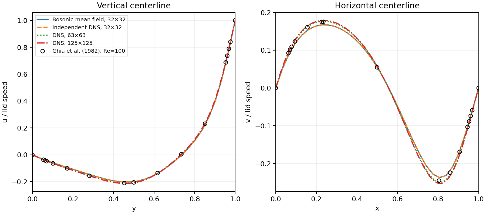
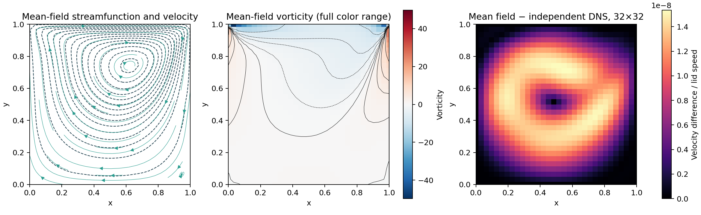
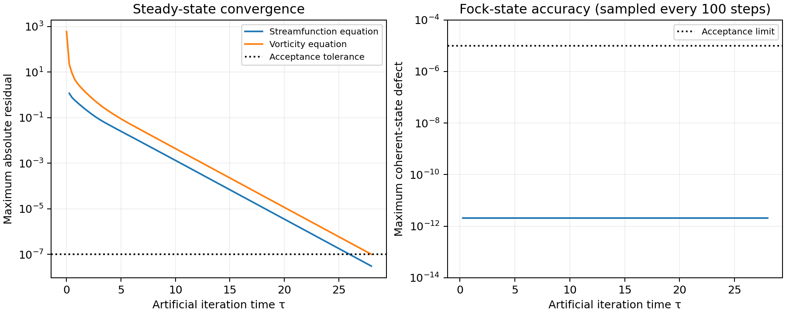

# Validated bosonic lid-driven cavity: 32×32, Re=100

The production solution evolves 1,800 local Fock vectors (900 streamfunction and 900 vorticity sites). The 32×32 grid includes walls. The lid moves right at unit speed, all other walls are stationary. DNS and published values are used only in this validation directory, after the mean-field run.

## Independent checks on the saved kets

- Both steady equations pass a maximum absolute residual tolerance of 1e-7: streamfunction 3.028237e-08; vorticity 9.965612e-08.
- Maximum discrete divergence: 3.065256e-15.
- Worst sampled coherent-state defect: 2.075907e-12; ceiling probability: 7.300562e-75.
- Primary streamfunction minimum: -0.1001591416, at grid point (x,y)=(0.612903,0.741935).
- 11,200 RK4 iterations, Δτ=0.0025, final τ=28.000. Measured runtime: 41.76 s on one CPU core.

τ is an artificial iteration coordinate; these snapshots are not a physical startup trajectory. Every run starts from vacuum interior kets; none is initialized from DNS.

## Independent DNS and numerical sensitivity

DNS separately integrates the physical vorticity equation using SSPRK3 and solves its own Dirichlet Poisson problem with sine transforms at each stage. It starts from a quiescent interior. The matched 32×32 comparison isolates the bosonic calculation from spatial discretization error.

| Comparison | Velocity relative L2 | Interior vorticity relative L2 |
|---|---:|---:|
| Mean field vs DNS32 | 3.998173e-08 | 2.220449e-08 |
| mf32_cutoff16 vs production | 0.000000e+00 | 0.000000e+00 |
| mf32_half_dt vs production | 1.575794e-12 | 2.507016e-12 |
| mf32_half_scales vs production | 4.983502e-12 | 7.905122e-12 |
| mf32_relax005 vs production | 7.400470e-08 | 3.976653e-08 |

Sensitivity runs change only the occupation cutoff (12→16), RK4 step (halved), both observable scales (halved), or streamfunction relaxation rate (0.1→0.05). They test the final steady solution; halving artificial time steps does not validate a physical transient. Reported norms use all interior nodes; singular lid-corner values are excluded.

## Published benchmark and spatial accuracy

Values were transcribed directly from Tables I–II (centerline velocities) and Table V (primary streamfunction minimum −0.103423) of [Ghia, Ghia & Shin (1982)](https://doi.org/10.1016/0021-9991(82)90058-4). Linear interpolation is used at the centerlines and at the paper's rounded sample coordinates.

| Run | Max absolute u error / lid speed | Max absolute v error / lid speed | ψ minimum |
|---|---:|---:|---:|
| mf32 | 0.009895 | 0.008678 | -0.100159142 |
| dns32 | 0.009895 | 0.008678 | -0.100159143 |
| dns63 | 0.002327 | 0.005245 | -0.102696288 |
| dns125 | 0.004447 | 0.008229 | -0.103307323 |

| Nested DNS grids | Velocity relative L2 difference |
|---|---:|
| 32 vs 63 | 4.803031e-02 |
| 63 vs 125 | 1.869885e-02 |

The 63×63 and 125×125 DNS grids halve the spacing successively from 32×32. The refined DNS establishes the size and trend of spatial error. Close agreement with DNS32 verifies the mean-field implementation, but does not make 32×32 a grid-converged continuum solution. The discontinuous lid velocity at the corners and the Thom wall-vorticity closure limit coarse-grid accuracy. The centerline differences from the published Ghia table are not monotonic between 63×63 and 125×125; the decreasing nested-grid differences, rather than monotonic agreement with that table, are the spatial refinement check. The 32×32 primary streamfunction minimum differs from Ghia by about 3.16%.







Exactly zero initial residuals/defects are omitted from logarithmic curves.

## Reproduce

From the repository root, install requirements and run:

```bash
export OPENBLAS_NUM_THREADS=1 OMP_NUM_THREADS=1 MPLCONFIGDIR=/tmp/ldc-matplotlib
python3 -m unittest discover -s tests -v
python3 -m validation.compare --results results
```

The full computation commands are in the root README and hpc/validate.sbatch. Solvers refuse to overwrite existing NPZ results: use a fresh output directory for recomputation. NPZ files contain the saved states or DNS fields, settings, convergence history, and source hashes. comparison.json records result-file SHA-256 hashes and all numerical metrics.
