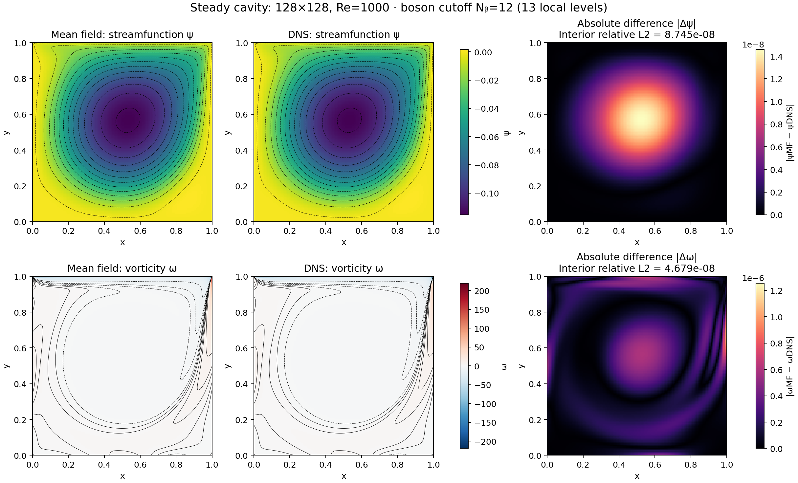
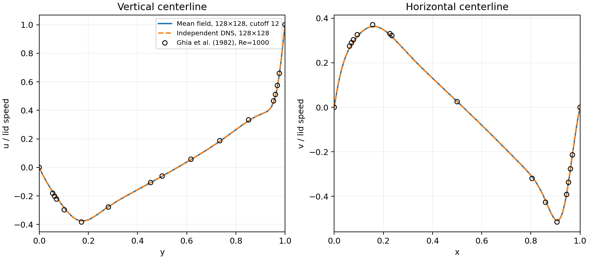
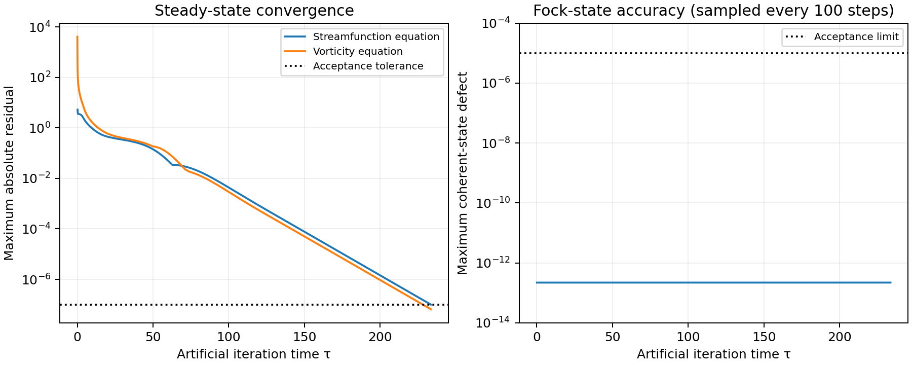

# 128×128 lid-driven cavity, Re=1000

The grid includes walls, h=1/127. The production state has 31,752 local Fock vectors with occupation cutoff **N_b=12** and **13 coefficients per site**. The mean-field solver evolves streamfunction and vorticity kets from vacuum. DNS is a separate verification calculation, starts from rest, and supplies no solution data to the mean-field run.

## Parameters and convergence

- Re=1000; unit square; unit right-moving lid; stationary no-slip side and bottom walls.
- Artificial RK4 step: 0.00125; streamfunction relaxation rate: 0.01.
- Observable scales: ψ=1000⟨aψ⟩, ω=100000⟨aω⟩.
- Iterations: 186,900; final artificial time: 233.625.
- Mean-field residuals: streamfunction 9.981360e-08, vorticity 6.513052e-08; tolerance 1.0e-07.
- Maximum discrete divergence: 1.283305e-14.
- Worst sampled coherent-state defect: 2.215267e-13; ceiling probability: 4.797703e-81.
- Measured runtime on one CPU: mean field 3.463 hours; DNS 0.155 hours.

The iteration coordinate is artificial time, not physical startup time. The mean-field calculation advances streamfunction and vorticity kets together with coupled RK4; it does not fully relax streamfunction after each individual vorticity update. Only residual-converged states are reported. The DNS integrates physical time with SSPRK3 and its own discrete sine-transform Poisson inverse.

## L2 error against independent DNS

The sum covers the 126×126 interior nodes. Absolute discrete L2=√Σ|e|²; spatial L2=h√Σ|e|² with h=1/127; relative L2=||e||₂/||DNS||₂. The vector norm includes both velocity components.

| Field | Absolute discrete L2 | Spatial L2 | Relative L2 | Max absolute error |
|---|---:|---:|---:|---:|
| Streamfunction ψ | 6.357750e-07 | 5.006102e-09 | 8.745218e-08 | 1.457766e-08 |
| Vorticity ω | 2.762760e-05 | 2.175401e-07 | 4.679486e-08 | 9.636756e-07 |
| u | 2.652523e-06 | 2.088601e-08 | 1.027246e-07 | 5.127824e-08 |
| v | 2.411842e-06 | 1.899088e-08 | 9.583478e-08 | 4.998333e-08 |
| Velocity vector | 3.585089e-06 | 2.822904e-08 | 9.942784e-08 | 5.127824e-08 |

## Published benchmark

Comparison against [Ghia, Ghia & Shin (1982)](https://doi.org/10.1016/0021-9991(82)90058-4), Tables I–II (centerline velocities) and Table V (primary streamfunction minimum). Centerlines and printed sample coordinates are linearly interpolated.

| Method | Max u error / lid speed | Max v error / lid speed | ψ minimum |
|---|---:|---:|---:|
| mean_field | 1.405358e-02 | 8.116020e-03 | -0.115412184 |
| dns | 1.405359e-02 | 8.116040e-03 | -0.115412170 |

This matched-grid comparison checks the bosonic calculation at this grid and Re. It does not by itself establish spatial convergence or cutoff/timestep convergence for this new case. The separate Re=100 refinement and sensitivity runs remain in the parent results directory.







[Field figure as PDF](cavity_fields.pdf). MF and DNS use shared field color scales; difference panels have independent error scales. Walls are plotted but excluded from norms.

## Reproduction

See `hpc/re1000_n128.sbatch` and `hpc/verify_re1000_n128.sbatch`. To regenerate this report from completed saved states:

```bash
python3 -m validation.case results/re1000_n128
```
